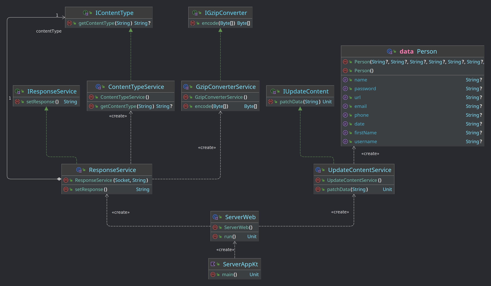

# Programare funcțională

Site-ul reprezintă un proiect la Programare Web și folosește elementele de bază ale HTML, CSS și JavaScript.

Site-ul este compus dintr-o singură pagină HTML, celelalte secțiuni fiind încărcate în site folosind AJAX.

## Server Web

Implementarea s-a realizat folosind un server web în limbajul de programare **Kotlin** și gestionarul de dependințe **Maven** și suportă gestiunea mai multor clienți simultan folosind corutine.

Diagrama de clase este ilustrată mai jos:

## Elemente de interacțiune și design

HTML, CSS și JavaScript sunt cele trei instrumente principale utilizate în dezvoltarea de site-uri web moderne. HTML (HyperText Markup Language) este utilizat pentru a crea structura paginii web, CSS (Cascading Style Sheets) este utilizat pentru a stabili aspectul vizual al paginii, iar JavaScript este utilizat pentru a adăuga interactivitate paginii.

În procesul de creare a unui site web, **HTML** este utilizat pentru a defini structura și conținutul paginii. Acest lucru include utilizarea de elemente HTML, cum ar fi etichetele "head" și "body" pentru a defini secțiunile paginii și utilizarea de elemente cum ar fi "div" și "span" pentru a organiza conținutul în secțiuni mai mici.

**CSS** este apoi utilizat pentru a da paginii un aspect vizual plăcut. Acest lucru poate include definirea culorilor, fonturilor, dimensiunilor și stilurilor de margini și cadre pentru elementele HTML. CSS poate fi aplicat în diferite moduri, cum ar fi prin includerea unui fișier CSS separat sau prin utilizarea de stiluri inline în cadrul etichetelor HTML.

**JavaScript** este apoi utilizat pentru a adăuga interactivitate paginii. Acest lucru poate include crearea de butoane care se schimbă de culoare atunci când utilizatorul trece cursorul peste ele sau adăugarea de efecte de animație la elementele de pe pagină. JavaScript poate fi inclus în pagină fie prin includerea unui fișier JavaScript separat, fie prin utilizarea de script-uri inline în cadrul etichetelor HTML.